# 📦 AI-Powered Shop Inventory Forecasting System

An intelligent inventory management platform that combines traditional inventory operations with Artificial Intelligence to predict product demand, optimize stock levels, identify inventory risks, and provide real-time business insights.

Built with **Laravel**, **React**, **Python (Prophet)**, **PostgreSQL**, and **Laravel Reverb**.

---

# 📑 Table of Contents

- Overview
- Screenshots
- Features
- System Architecture
- AI Architecture
- Technology Stack
- Core Modules
- Database Design
- Installation
- Running the AI Engine
- Real-Time Dashboard
- Deployment
- Future Improvements
- Author

---

# 🚀 Overview

Managing inventory efficiently is one of the biggest challenges for retail businesses. Overstocking increases storage costs while understocking results in lost sales.

This project addresses these challenges by combining an Inventory Management System with an AI forecasting engine capable of:

- Predicting future product demand
- Recommending inventory actions
- Detecting inventory risks
- Generating intelligent business insights
- Updating analytics dashboards in real time

The AI engine continuously analyzes historical sales data and inventory levels to help businesses make better inventory decisions.


---
# 📸 System Screenshots

## 🏠 Welcome Page

The landing page introducing the inventory management platform.

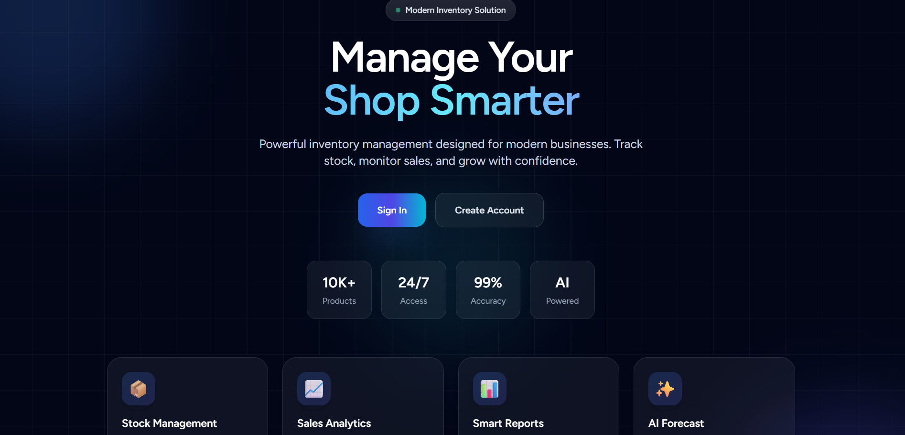


---

## 📊 Dashboard

Main business overview showing inventory statistics, sales performance, and system KPIs.

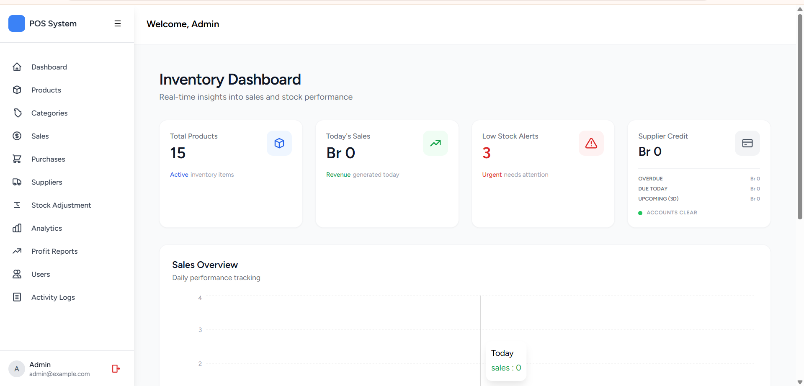


---

## 📦 Product Management

Manage products, pricing, stock quantity, and product information.

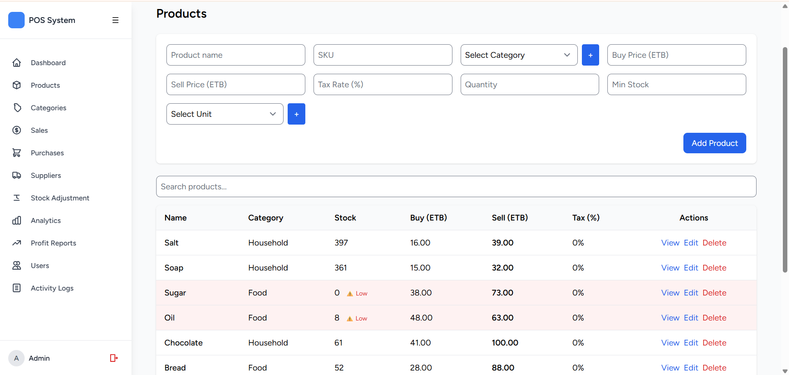


---

## 🏷️ Category & Supplier Management

Organize products using categories and manage supplier information.

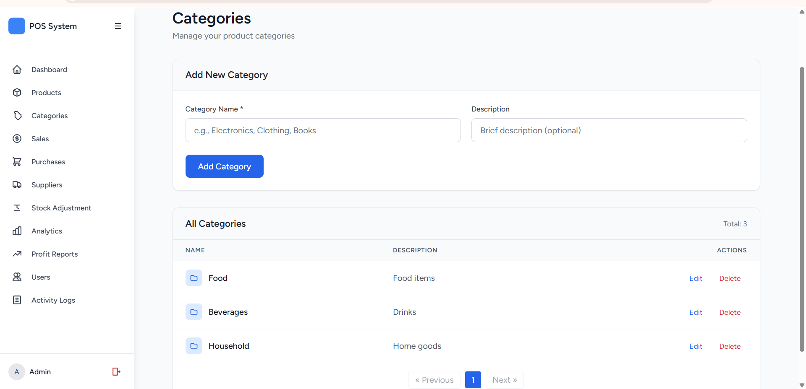

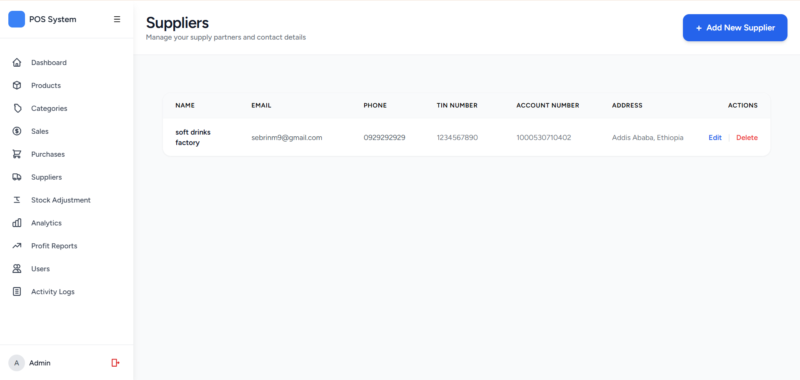


---

## 💰 Sales and Purchase Management

Track sales transactions, purchases, and business operations.

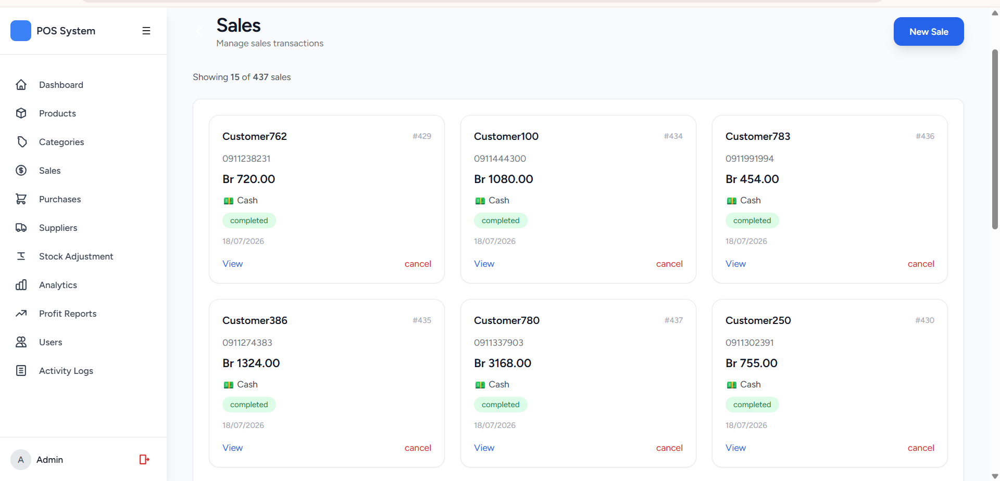

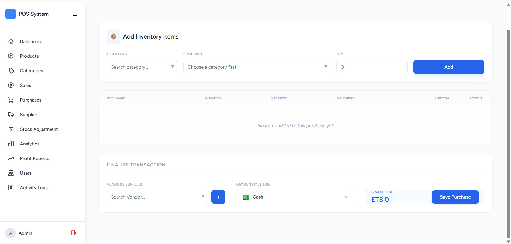


---

## 📈 Profit Analytics

Monitor revenue, costs, and profitability.

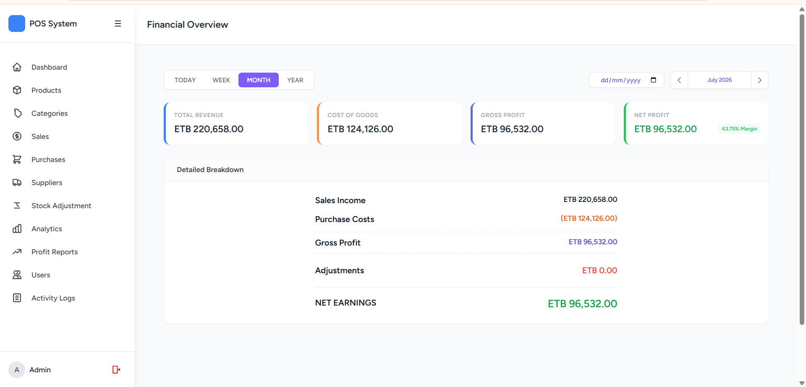


---

## 🤖 AI Forecasting Analytics Dashboard ⭐

AI-powered demand prediction, stock analysis, alerts, and recommendations.

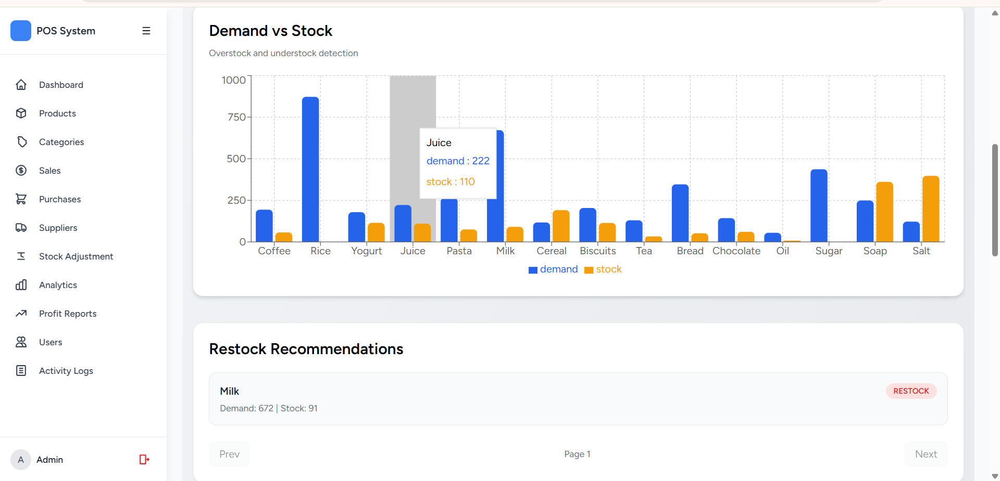


---

## 📦 Stock Adjustment

Manage inventory changes and stock corrections.

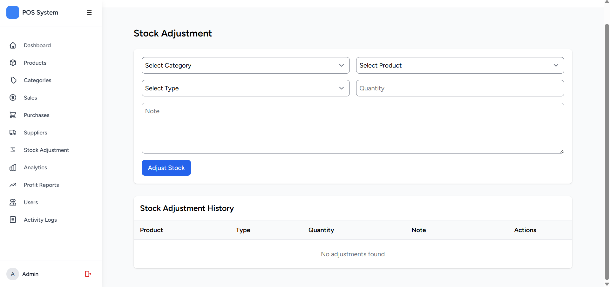


---

## 👥 User Management

Manage system users and access control.

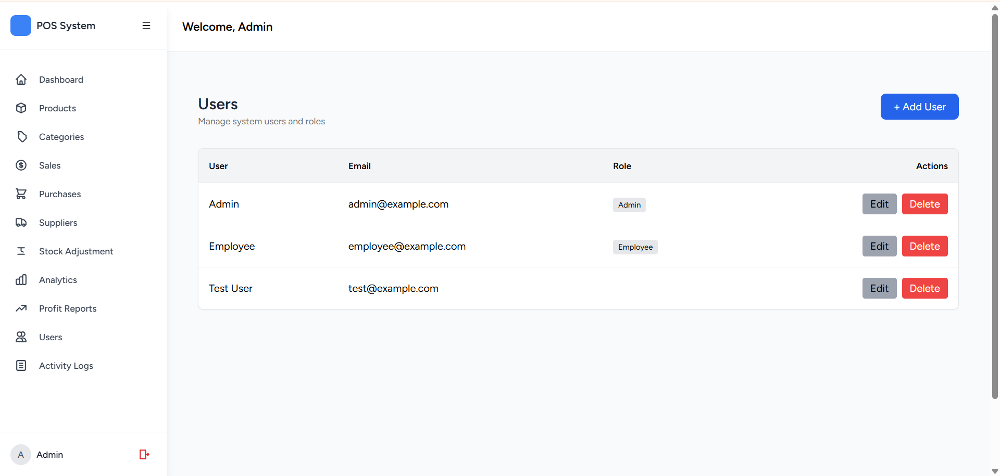


---

## 🔐 Activity Log

Tracks important system activities for auditing and transparency.

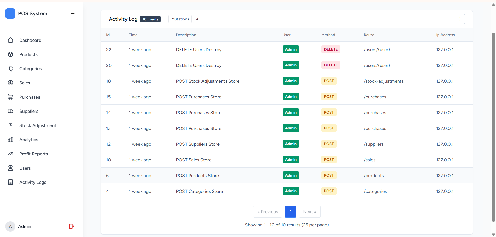

---

# ✨ Features

## 📦 Inventory Management

- Product Management
- Category Management
- Supplier Management
- Purchase Management
- Sales Management
- Inventory Tracking
- Stock Adjustments

---

## 📈 Business Analytics

- Sales Dashboard
- Profit Analysis
- Inventory Performance
- Activity Logs
- Business KPIs

---

## 🤖 AI Forecasting Engine

The Python AI Engine provides:

- Demand Forecasting
- Stock Recommendation
- Inventory Risk Assessment
- AI Insights
- Alert Generation
- Daily Business Snapshot

---

## ⚡ Real-Time Dashboard

The analytics dashboard updates automatically whenever new AI predictions are generated.

Powered by:

- Laravel Events
- Laravel Reverb
- Laravel Echo
- React State Management

No page refresh is required.

---

# 🧠 AI Pipeline

```
Sales History
        │
        ▼
Data Cleaning
        │
        ▼
Prophet Forecasting
        │
        ▼
Decision Engine
        │
        ▼
Risk Engine
        │
        ▼
Explanation Engine
        │
        ▼
Alert Engine
        │
        ▼
AI Database
        │
        ▼
Laravel Event
        │
        ▼
Reverb WebSocket
        │
        ▼
React Analytics Dashboard
```

---

# 🏗️ System Architecture

```
                  React + Inertia.js
                         │
                         ▼
                 Laravel Backend
                  (Business Logic)
                  │            │
                  │            │
                  ▼            ▼
           PostgreSQL      Laravel Reverb
                  ▲            │
                  │            ▼
            Python AI Engine ─────► Live Dashboard
```

---

# 🧩 AI Architecture

The AI Engine consists of multiple independent layers.

### Forecast Engine

- Prophet Time Series Forecasting
- Demand Prediction
- Trend Detection

---

### Decision Engine

Determines:

- Restock
- Hold
- Reduce Inventory

using business rules and mathematical models.

---

### Risk Engine

Calculates inventory risks including:

- Overstock Risk
- Understock Risk
- Demand Spike Risk

---

### Explanation Engine

Generates human-readable explanations for every AI decision.

Example:

> "Predicted demand exceeds available stock. Restocking is recommended."

---

### Alert Engine

Automatically generates alerts such as:

- Low Stock
- Overstock
- Demand Spike
- Restock Required

---

# 💻 Technology Stack

## Backend

- Laravel 12
- PHP 8.4

## Frontend

- React
- Inertia.js
- Tailwind CSS
- Recharts

## AI Engine

- Python
- Prophet
- Pandas
- NumPy
- SQLAlchemy

## Database

- PostgreSQL

## Real-Time

- Laravel Reverb
- Laravel Echo

## Deployment

- Docker
- Render
- GitHub Actions

---

# 📚 Core Modules

- Dashboard
- Products
- Categories
- Suppliers
- Purchases
- Sales
- Stock Adjustments
- Activity Logs
- Profit Dashboard
- AI Analytics Dashboard
- AI Predictions
- AI Insights
- AI Alerts

---

# 🗄️ AI Database Tables

The AI Engine stores generated results inside dedicated tables.

- ai_predictions
- ai_insights
- ai_alerts
- ai_snapshots

Each prediction updates the existing product record instead of creating duplicates.

---

# 📂 Project Structure

```
shop-inventory-forecasting/

├── app/
├── bootstrap/
├── config/
├── database/
├── inventory-ai/
├── public/
├── resources/
├── routes/
├── storage/
├── docs/
├── Dockerfile
└── README.md
```

---

# ⚙️ Installation

## Clone Repository

```bash
git clone https://github.com/YOUR_USERNAME/shop-inventory-forecasting.git

cd shop-inventory-forecasting
```

---

## Install Laravel

```bash
composer install
```

---

## Install Frontend

```bash
npm install

npm run build
```

---

## Configure Environment

```bash
cp .env.example .env

php artisan key:generate
```

---

## Database

```bash
php artisan migrate

php artisan db:seed
```

---

## Start Laravel

```bash
php artisan serve
```

---

# 🤖 Running the AI Engine

Navigate to the AI project:

```bash
cd inventory-ai
```

Install dependencies

```bash
pip install -r requirements.txt
```

Run forecasting

```bash
python run_forecast.py
```

The AI Engine will:

- Read historical sales
- Forecast demand
- Generate AI insights
- Create alerts
- Save predictions
- Broadcast updates to Laravel

---

# ⚡ Real-Time Updates

Start Laravel Reverb locally:

```bash
php artisan reverb:start
```

Whenever the AI Engine finishes forecasting:

```
Python AI
      │
      ▼
Laravel API
      │
      ▼
DashboardUpdated Event
      │
      ▼
Laravel Reverb
      │
      ▼
React Dashboard
```

The Analytics page updates instantly without refreshing.

---

# 🚀 Deployment

The application is deployed using Render.

Services:

- Laravel Web Service
- Python AI Service
- PostgreSQL Database
- Laravel Reverb Service

Each service runs independently while communicating through REST APIs and WebSockets.

# 🎯 Technical Challenges Solved

- Laravel + Python integration
- AI demand forecasting using Prophet
- Inventory decision engine
- Risk scoring algorithms
- Real-time dashboard updates
- WebSocket deployment with Laravel Reverb
- PostgreSQL optimization
- Docker deployment
- GitHub Actions automation

---

# 🔮 Future Improvements

- Multi-store inventory
- Supplier recommendation engine
- Automatic purchase order generation
- AI chatbot assistant
- Seasonal forecasting
- Deep learning forecasting models
- Email and SMS notifications
- Mobile application

---

# 👨‍💻 Author

**Sebrina Musbah**

Software Engineering student

---

# 📄 License

This project was developed for educational, internship, and portfolio purposes.
